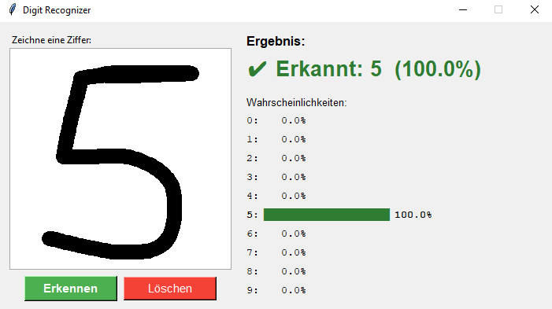
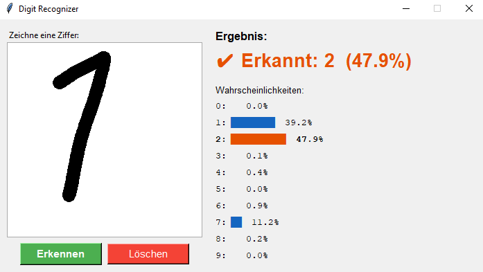
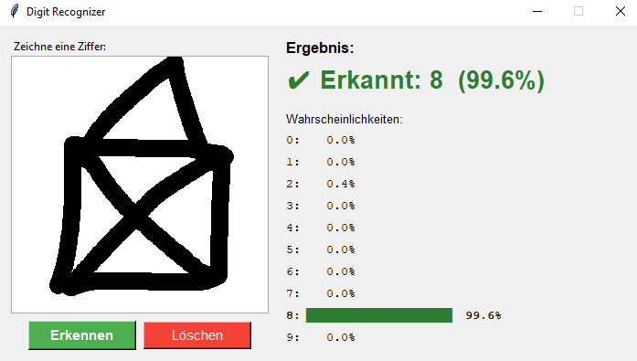
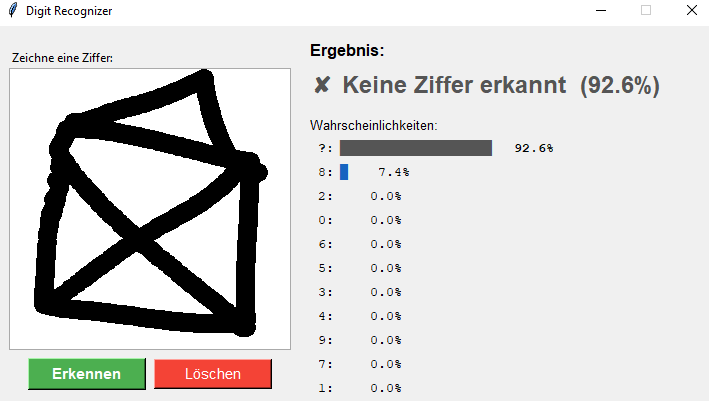

# Digit Recognizer

Dieses Projekt war dazu gedacht, mein Wissen über CNNs zu vertiefen, aber auch um mal das Vibe-coden auszuprobieren. Bisher habe ich Vibe-coding immer belächelt, aber mit dem richtigen Setup bekommt man doch sehr schnell Ergebnisse, wenn die Aufgabe nicht super komplex ist.
So ist dann ein Python-Desktop-Tool entstanden, das handgeschriebene Ziffern (0–9) erkennt. Man malt mit der Maus eine Ziffer in das Zeichenfeld, und ein trainiertes neuronales Netz gibt eine Wahrscheinlichkeitsverteilung für alle **11 Klassen** aus oder erkennt, dass gar keine Ziffer gezeichnet wurde.

<p align="center">
  
</p>

---

## Installation & Ausführung

```bash
pip install -r requirements.txt
python train.py      # Einmalig: Modell trainieren (~5 Min.)
python app.py        # App starten
```

---

## Vibe-coding als Prozess

Zunächst habe ich die AGENTS.md Datei erstellen lassen, die dazu dient, dass der AI-Agent immer genau weiß, was das Projekt beinhaltet, also was das Ziel der Aufgabe ist, was schon ausgeführt wurde, wie der Aufbau ist usw.
Nach ca. 15 Minuten war das Tool auch schon fertig und es hat tatsächlich einigermaßen funktioniert.
Es gab zum Teil Probleme beim erkennen von der "1", was allerdings an den Trainingsdaten lag. In den USA schreibt man die 1 scheinbar nur als vertikalen Strich, sodass die 1 in der Praxis oft als 7 oder auch als 2 erkannt wurde.

<p align="center">
  
</p>

Außerdem ist mir aufgefallen, dass die Option fehlt, dass gar keine Nummer erkannt wird. Bei einem Haus wurde dann die 8 erkannt.

<p align="center">
  
</p>

Nach einer kleinen Änderung hat auch dieses Feature funktioniert und dafür, dass nur 20 Minuten gevibecoded wurde, ist das Ergebnis schon recht gut.

<p align="center">
  
</p>

Insgesamt macht Vibe-coden schon Spaß, da AI einfach viel schneller Code generieren kann, sodass für den Anwender mehr Zeit bleibt, um über Features und UI nachzudenken.
Bei etwas größeren Projekten könnte es allerdings zu Problemen kommen.

---

## Das Modell

Verwendet wird ein **Convolutional Neural Network (CNN)**, das auf dem MNIST-Datensatz basiert. Die Architektur besteht aus drei Faltungsschichten, die zunehmend komplexere Muster erkennen, gefolgt von vollständig verbundenen Schichten zur Klassifikation:

```
Conv2D(32) → MaxPooling → Conv2D(64) → MaxPooling → Conv2D(64)
→ Flatten → Dense(128) → Dropout(0.4) → Dense(11, softmax)
```

Die 11. Ausgabe-Klasse (`?`) wurde nachträglich ergänzt, damit das Modell auch erkennen kann, wenn gar keine Ziffer gezeichnet wurde.

## Das Training

Trainiert wurde auf insgesamt **80.000 Bildern** in 10 Epochen:

- **60.000 Ziffern-Bilder** aus MNIST (Klassen 0–9)
- **20.000 synthetische Nicht-Ziffern** als Klasse 10 – darunter zufällige Linien, Rechtecke, Dreiecke, Häuser, Kreuze und Rauschen

Da die Klassen stark ungleich verteilt waren (60.000 vs. 20.000), wurden **Klassen-Gewichte** eingesetzt, damit das Modell die seltene Klasse 10 nicht ignoriert. Zusätzlich wurde **Data Augmentation** (leichte Rotation und Verschiebung) verwendet, um das Modell robuster gegen unterschiedliche Schreibstile zu machen – was vor allem bei der problematischen „1" geholfen hat.

Das Ergebnis: **98,7 % Gesamtgenauigkeit** auf dem Testset und **99,8 % Erkennungsrate** für die Unbekannt-Klasse.

